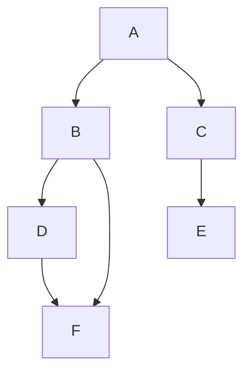

# 🔗 Repository

## [CAPSTONE-DS Repository](https://github.com/chandraprakashmishra18/CAPSTONE-DS.git?utm_source=chatgpt.com)

---

# 🚀 Social Network Explorer (SNE)

<p align="center">
  
</p>

> ⚡ A Data Structures Capstone Project implementing **Graph + BFS + DFS + Hashing + Sorting**
> 🎯 Built to simulate a **real-world social network system**

---

# 🧠 Project Overview

This project demonstrates how **core Data Structures concepts** are applied in real-world systems like Instagram, LinkedIn, etc.

According to modern capstone project practices, such projects are meant to **apply learned concepts into real-world systems** ([GitHub][1]).

---

# 🎬 Demo Preview

<p align="center">
  
</p>

---

# 🏗️ Architecture

```mermaid
graph TD
    A[User Profiles (HashMap)] --> B[Graph (Adjacency List)]
    B --> C[BFS - Shortest Path]
    B --> D[DFS - Depth Traversal]
    B --> E[Recommendation Engine]
```

---

# ⚙️ Features

✨ **User Management**

* Add / Update / View profiles
* Stored using **Hash Tables (O(1))**

✨ **Social Graph**

* Friend connections using **Adjacency List**

✨ **Shortest Path (BFS)**

* Find degrees of separation

✨ **Deep Exploration (DFS)**

* Explore network up to depth *d*

✨ **Recommendations**

* Based on **Mutual Friends + Sorting**

---

# 🧩 Data Structures Used

| Concept         | Usage               |
| --------------- | ------------------- |
| Hash Table      | Profile Storage     |
| Graph           | Network Connections |
| Queue           | BFS                 |
| Stack/Recursion | DFS                 |
| Sorting         | Recommendations     |

---

# ⚡ Complexity Analysis

```mermaid
graph LR
A[BFS] -->|Time| B[O(V+E)]
C[DFS] -->|Time| D[O(V+E)]
E[Recommendation] -->|Time| F[O(V²)]
```

---

# 🖥️ How It Works (Step-by-Step)

### 1️⃣ Add Users

```python
sne.add_user("A", ["music", "sports"])
```

### 2️⃣ Create Connections

```python
sne.add_connection("A", "B")
```

### 3️⃣ Find Shortest Path

```python
sne.shortest_path("A", "F")
```

### 4️⃣ Explore Network

```python
sne.dfs_depth("A", 2)
```

---

# 📊 Sample Output

```
Shortest Path A -> F: ['A', 'B', 'F']
DFS from A depth 2: ['A', 'B', 'D', 'F', 'C', 'E']
Recommendations: [('D', 1), ('F', 1)]
```

---

# 🎯 Real-World Mapping

| Feature | Real App Example      |
| ------- | --------------------- |
| BFS     | LinkedIn connections  |
| DFS     | Friend suggestions    |
| Hashing | User profiles         |
| Sorting | Instagram suggestions |

---

# 🎨 Visualization (Graph)



---

# 📁 Project Structure

```
CAPSTONE-DS/
│── main.py
│── graph.py
│── bfs.py
│── dfs.py
│── recommendation.py
│── README.md
```

---

# ▶️ Run Locally

```bash
git clone https://github.com/chandraprakashmishra18/CAPSTONE-DS.git
cd CAPSTONE-DS
python main.py
```

---

# 🧪 Test Cases

✔ Add 6–8 users
✔ Create 8–12 connections
✔ Run BFS (2 queries)
✔ Run DFS (depth 2 & 3)
✔ Show recommendations

---

# 🔥 Key Learnings

* Real-world use of **Graphs**
* Efficiency of **BFS vs DFS**
* Importance of **Hashing (O(1))**
* Trade-offs in **algorithm complexity**

---

# 🧑‍💻 Author

👤 **Chandra Prakash Mishra**
📌 Data Structures Capstone Project

---

# ⭐ Support

If you like this project:

```diff
+ ⭐ Star the repo
+ 🍴 Fork it
+ 🧠 Use it in your viva
```

---

# 💡 Bonus (To Impress Examiner)

Add these lines verbally:

* “This system mimics LinkedIn graph traversal”
* “BFS guarantees shortest path in unweighted graphs”
* “Recommendation system uses mutual connections ranking”

---

# 🚀 Want Next Level?

I can upgrade this further into:

* 🔥 **Live animated UI (React + Graph Visualization)**
* 📊 **Interactive dashboard**
* 🎥 **Screen recording demo for submission**
* 📄 **Final PDF report (college format)**

Just tell me 👍

[1]: https://github.com/dennislamcv1/DS0720ENFeb2020?utm_source=chatgpt.com "dennislamcv1/DS0720ENFeb2020: Data Science and ..."
